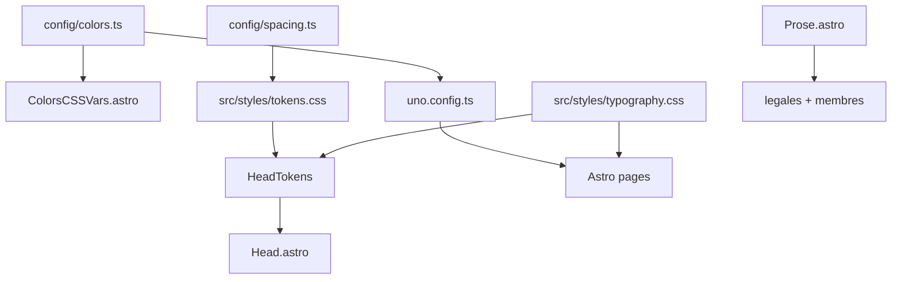

# Tokens + UnoCSS (constrained) Implementation Plan

> **For agentic workers:** REQUIRED SUB-SKILL: Use superpowers:subagent-driven-development (recommended) or superpowers:executing-plans to implement this plan task-by-task. Steps use checkbox (`- [ ]`) syntax for tracking.

**Goal:** Add UnoCSS for layout velocity while keeping `config/colors.ts` as the single source of truth for colors and semantic typography classes for brand rigor.

**Architecture:** `ColorsCSSVars.astro` continues to emit runtime `--color-*` vars. `uno.config.ts` maps Uno theme colors to those vars via existing [`semanticColorsForUno()`](config/colors.ts). Layout utilities (`flex`, `gap`, `p-*`) come from `presetUno`; typography stays in [`src/styles/typography.css`](src/styles/typography.css) as `.t-h1`, `.t-body`, etc. Content pages wrap in [`Prose.astro`](src/components/layout/Prose.astro) using Uno shortcuts only for structure.

**Tech Stack:** Astro 6, UnoCSS (`unocss` + `unocss/astro`), existing OKLCH tokens, Biome, `pnpm build` as verification (no test runner in repo).

**Save this plan to:** [`docs/superpowers/plans/2026-06-10-tokens-unocss.md`](docs/superpowers/plans/2026-06-10-tokens-unocss.md) (copy from `.cursor/plans/` after creation — do not edit the `.cursor/plans` source file).

---

## File map

| File | Responsibility |
|------|----------------|
| [`uno.config.ts`](uno.config.ts) | Preset, semantic colors, spacing theme, layout shortcuts, safelist |
| [`config/spacing.ts`](config/spacing.ts) | Spacing token scale (`sp1`…`sp16`) |
| [`src/styles/tokens.css`](src/styles/tokens.css) | Global `--sp-*` + font family aliases on `:root` |
| [`src/styles/typography.css`](src/styles/typography.css) | `.t-h1`…`.t-mono-sm`, `.a-accent`, `.a-muted`, `.a-faint` |
| [`src/layouts/head/HeadTokens.astro`](src/layouts/head/HeadTokens.astro) | Injects `tokens.css` + `typography.css` globally |
| [`src/components/layout/Prose.astro`](src/components/layout/Prose.astro) | Content page shell (`page-container` + `stack-lg`) |
| [`src/styles/design-system.css`](src/styles/design-system.css) | DS mockup styles moved out of `index.astro` |
| [`docs/css-conventions.md`](docs/css-conventions.md) | Allowed / forbidden utility patterns |



---

## Conventions (enforce in code review)

**Allowed Uno utilities:** layout (`flex`, `grid`, `gap-*`, `items-*`, `justify-*`), spacing (`p-*`, `m-*`, `px-*`, `py-*`), sizing (`max-w-*`, `w-full`), semantic colors (`text-primary`, `bg-secondary`, `border-bdInfo`, alpha `/25`).

**Forbidden:** default palette utilities (`text-blue-500`, `bg-gray-100`), arbitrary color values (`text-[#fff]`), replacing `.t-h1` with `text-4xl font-bold` on branded headings.

**Typography:** use `.t-h1`…`.t-mono-sm` classes or future Astro components — not raw Uno font-size utilities on marketing headings.

---

### Task 1: Install UnoCSS

**Files:**
- Modify: [`package.json`](package.json)

- [ ] **Step 1: Install packages**

```bash
pnpm add -D unocss
```

- [ ] **Step 2: Verify install**

```bash
pnpm exec unocss --version
```

Expected: version string (e.g. `66.x.x`)

- [ ] **Step 3: Commit**

```bash
git add package.json pnpm-lock.yaml
git commit -m "chore: add unocss dependency"
```

---

### Task 2: UnoCSS config with semantic colors

**Files:**
- Create: [`uno.config.ts`](uno.config.ts)

- [ ] **Step 1: Create config**

```ts
import { ColorData, semanticColorsForUno } from "@config/colors";
import {
	defineConfig,
	presetUno,
	transformerVariantGroup,
} from "unocss";

export default defineConfig({
	presets: [presetUno()],
	transformers: [transformerVariantGroup()],
	theme: {
		colors: semanticColorsForUno(ColorData.colors.light),
		fontFamily: {
			heading: "var(--font-syne)",
			body: "var(--font-source-serif-4)",
			mono: "var(--font-victor-mono)",
		},
	},
	shortcuts: {
		stack: "flex flex-col gap-4",
		"stack-lg": "flex flex-col gap-8",
		"stack-sm": "flex flex-col gap-2",
		"page-container": "mx-auto max-w-3xl px-6 py-10",
		"page-container-wide": "mx-auto max-w-5xl px-6 py-10",
	},
	blocklist: [
		/^(text|bg|border|ring|fill|stroke)-(slate|gray|zinc|neutral|stone|red|orange|amber|yellow|lime|green|emerald|teal|cyan|sky|blue|indigo|violet|purple|fuchsia|pink|rose)-/,
	],
});
```

Note: `blocklist` rejects Tailwind default palette utilities; semantic tokens (`text-primary`) still work via `theme.colors`.

- [ ] **Step 2: Commit**

```bash
git add uno.config.ts
git commit -m "feat: add constrained uno.config with semantic colors"
```

---

### Task 3: Astro integration

**Files:**
- Modify: [`astro.config.mjs`](astro.config.mjs)

- [ ] **Step 1: Register integration** (add import + integration; do **not** enable `injectReset` — avoids fighting existing base styles)

```js
import UnoCSS from "unocss/astro";

export default defineConfig({
	integrations: [
		sitemap({ entryLimit: 1000 }),
		seoGraph({ /* unchanged */ }),
		UnoCSS(),
	],
	// ...rest unchanged
});
```

- [ ] **Step 2: Build smoke test**

```bash
pnpm build 2>&1 | tail -5
```

Expected: `Complete!` (no UnoCSS errors)

- [ ] **Step 3: Commit**

```bash
git add astro.config.mjs
git commit -m "feat: wire unocss astro integration"
```

---

### Task 4: Spacing tokens

**Files:**
- Create: [`config/spacing.ts`](config/spacing.ts)
- Create: [`src/styles/tokens.css`](src/styles/tokens.css)
- Modify: [`uno.config.ts`](uno.config.ts) — add `theme.spacing`

- [ ] **Step 1: Create spacing config**

```ts
/* config/spacing.ts */

export const spacing = {
	sp1: "0.25rem",
	sp2: "0.5rem",
	sp3: "0.75rem",
	sp4: "1rem",
	sp6: "1.5rem",
	sp8: "2rem",
	sp10: "2.5rem",
	sp12: "3rem",
	sp16: "4rem",
} as const;

export type SpacingToken = keyof typeof spacing;

export function spacingToCSSVars(): string {
	return Object.entries(spacing)
		.map(([token, value]) => `  --${token}: ${value};`)
		.join("\n");
}
```

- [ ] **Step 2: Create tokens.css**

```css
/* src/styles/tokens.css */
:root {
	--font-heading: var(--font-syne);
	--font-body: var(--font-source-serif-4);
	--font-mono: var(--font-victor-mono);
	/* spacing vars injected by HeadTokens.astro from config/spacing.ts */
}
```

- [ ] **Step 3: Extend uno.config.ts theme.spacing**

```ts
import { spacing } from "@config/spacing";

// inside theme:
spacing: Object.fromEntries(
	Object.entries(spacing).map(([k, v]) => [k.replace("sp", ""), v]),
),
// maps sp4 → key "4" → p-4 uses 1rem; also add full names:
// spacing: { ...Object.fromEntries(...), sp4: "var(--sp4)" } 
```

Use explicit mapping for clarity:

```ts
spacing: {
	1: spacing.sp1,
	2: spacing.sp2,
	3: spacing.sp3,
	4: spacing.sp4,
	6: spacing.sp6,
	8: spacing.sp8,
	10: spacing.sp10,
	12: spacing.sp12,
	16: spacing.sp16,
},
```

- [ ] **Step 4: Commit**

```bash
git add config/spacing.ts src/styles/tokens.css uno.config.ts
git commit -m "feat: add spacing tokens shared by CSS and UnoCSS"
```

---

### Task 5: Global typography extraction

**Files:**
- Create: [`src/styles/typography.css`](src/styles/typography.css)
- Modify: [`src/pages/index.astro`](src/pages/index.astro) — remove duplicated `.t-*` / `.a-*` rules from `<style>` block

- [ ] **Step 1: Create typography.css** — move these classes from `index.astro` lines ~450–540:

```css
.t-h1 { font-family: var(--font-heading); font-size: clamp(3.5rem, 5.5vw, 5rem); font-weight: 600; line-height: 1; letter-spacing: -0.03em; }
.t-h2 { font-family: var(--font-heading); font-size: clamp(2.4rem, 3.8vw, 3.2rem); font-weight: 700; line-height: 1.08; letter-spacing: -0.02em; }
.t-h3 { font-family: var(--font-body); font-size: clamp(1.7rem, 2.5vw, 2.2rem); font-weight: 600; line-height: 1.2; letter-spacing: -0.01em; }
.t-h4 { font-family: var(--font-body); font-size: clamp(1.2rem, 1.6vw, 1.5rem); font-weight: 600; line-height: 1.3; letter-spacing: 0; }
.t-lead { font-family: var(--font-body); font-size: clamp(1.05rem, 1.3vw, 1.2rem); font-weight: 400; line-height: 1.75; letter-spacing: 0.01em; }
.t-body { font-family: var(--font-body); font-size: clamp(1rem, 1.1vw, 1.075rem); font-weight: 400; line-height: 1.7; letter-spacing: 0.005em; }
.t-small { font-family: var(--font-body); font-size: 0.8375rem; font-weight: 400; line-height: 1.65; letter-spacing: 0.01em; }
.t-caption { font-family: var(--font-body); font-size: 0.77rem; font-style: italic; font-weight: 300; line-height: 1.6; letter-spacing: 0.02em; }
.t-mono { font-family: var(--font-mono); font-size: 0.875rem; font-style: italic; font-weight: 400; line-height: 1.6; letter-spacing: 0.03em; }
.t-mono-sm { font-family: var(--font-mono); font-size: 0.77rem; font-style: italic; font-weight: 400; line-height: 1.55; letter-spacing: 0.04em; }
.a-accent { color: var(--color-accent); }
.a-muted { color: var(--color-muted); }
.a-faint { color: var(--color-faint); }
```

- [ ] **Step 2: Delete moved rules from `index.astro` `<style>`** — keep only `.ds-*`, `.col`, `.block`, `.meta`, `.spec*`, etc.

- [ ] **Step 3: Remove font aliases from `.ds` block** (now in `tokens.css`)

- [ ] **Step 4: Build**

```bash
pnpm build 2>&1 | grep -E "H1 validation|Complete"
```

Expected: H1 validation passes

- [ ] **Step 5: Commit**

```bash
git add src/styles/typography.css src/pages/index.astro
git commit -m "refactor: extract global typography classes"
```

---

### Task 6: HeadTokens injection

**Files:**
- Create: [`src/layouts/head/HeadTokens.astro`](src/layouts/head/HeadTokens.astro)
- Modify: [`src/layouts/Head.astro`](src/layouts/Head.astro)

- [ ] **Step 1: Create HeadTokens.astro**

```astro
---
import { spacingToCSSVars } from "@config/spacing";

const spacingVars = spacingToCSSVars();
---

<style is:global>
	@import "../../styles/tokens.css";
	@import "../../styles/typography.css";

	:root {
		{spacingVars}
	}
</style>
```

Alternative if Astro `@import` in component style fails: use two `<style is:global set:html={...}>` blocks or inline spacing vars via `spacingToCSSVars()` in frontmatter (same pattern as [`ColorsCSSVars.astro`](src/components/utils/ColorsCSSVars.astro)).

- [ ] **Step 2: Add to Head.astro** after `HeadTheme`, before `BaseMeta`:

```astro
<HeadTokens />
```

- [ ] **Step 3: Build + commit**

```bash
pnpm build && git add src/layouts/head/HeadTokens.astro src/layouts/Head.astro && git commit -m "feat: inject global design tokens and typography in head"
```

---

### Task 7: Prose layout component

**Files:**
- Create: [`src/components/layout/Prose.astro`](src/components/layout/Prose.astro)

- [ ] **Step 1: Create component**

```astro
---
interface Props {
	wide?: boolean;
}

const { wide = false } = Astro.props;
const containerClass = wide ? "page-container-wide" : "page-container";
---

<article class:list={[containerClass, "stack-lg", "text-primary"]}>
	<slot />
</article>
```

- [ ] **Step 2: Commit**

```bash
git add src/components/layout/Prose.astro
git commit -m "feat: add Prose layout component with uno shortcuts"
```

---

### Task 8: Migrate content pages to Prose + typography

**Files:**
- Modify: [`src/pages/legales/mentions-legales.astro`](src/pages/legales/mentions-legales.astro)
- Modify: [`src/pages/legales/politique-confidentialite.astro`](src/pages/legales/politique-confidentialite.astro)
- Modify: [`src/pages/membres/index.astro`](src/pages/membres/index.astro)
- Modify: [`src/pages/membres/[slug].astro`](src/pages/membres/[slug].astro)
- Modify: [`src/pages/404.astro`](src/pages/404.astro)

- [ ] **Step 1: Wrap content in Prose** — example for mentions-legales:

```astro
---
import Prose from "@components/layout/Prose.astro";
// ...existing imports
---

<Layout {...layoutProps(meta)}>
	<Prose>
		<h1 class="t-h2">Mentions légales</h1>
		<section class="stack">
			<h2 class="t-h4">Éditeur du site</h2>
			<!-- ... -->
		</section>
	</Prose>
</Layout>
```

- [ ] **Step 2: Apply same pattern** to politique-confidentialite, membres index/slug, 404 (use `t-h2` on h1, `t-h4` on h2, `t-body` on paragraphs where plain `<p>` needs body styling)

- [ ] **Step 3: Build**

```bash
pnpm build 2>&1 | tail -8
```

Expected: 7 pages, H1 + internal links OK

- [ ] **Step 4: Commit**

```bash
git add src/pages/
git commit -m "feat: migrate content pages to Prose layout and typography classes"
```

---

### Task 9: Extract design-system.css from index

**Files:**
- Create: [`src/styles/design-system.css`](src/styles/design-system.css)
- Modify: [`src/pages/index.astro`](src/pages/index.astro)

- [ ] **Step 1: Move all remaining `<style>` rules** (`.ds`, `.col`, `.ds-header`, `.ds-btn`, etc.) into `design-system.css`

- [ ] **Step 2: Replace `<style>` block in index.astro** with:

```astro
<style>
	@import "../styles/design-system.css";
</style>
```

Keep the separate `<style is:global set:html={colDarkCSS}>` block for dark column demo unchanged.

- [ ] **Step 3: Build visual check** — homepage DS sections still render (build passes)

- [ ] **Step 4: Commit**

```bash
git add src/styles/design-system.css src/pages/index.astro
git commit -m "refactor: extract design system styles from index page"
```

---

### Task 10: Documentation

**Files:**
- Create: [`docs/css-conventions.md`](docs/css-conventions.md)
- Modify: [`docs/astro-seo-graph.md`](docs/astro-seo-graph.md) — add row for CSS stack (optional one-liner)

- [ ] **Step 1: Write css-conventions.md** covering:
  - Token sources (`config/colors.ts`, `config/spacing.ts`)
  - Uno allowed / forbidden utilities (from Conventions section above)
  - When to use `.t-*` vs `Prose` vs scoped Astro `<style>`
  - Example page snippet

- [ ] **Step 2: Commit**

```bash
git add docs/
git commit -m "docs: add CSS and UnoCSS conventions"
```

---

### Task 11: Final verification

- [ ] **Step 1: Full build**

```bash
pnpm check:fix && pnpm build
```

Expected: exit 0, H1 validation OK, internal links OK

- [ ] **Step 2: Confirm UnoCSS output is minimal**

```bash
grep -r "text-blue\|bg-gray" src/pages/ || echo "no default palette utilities"
```

Expected: `no default palette utilities`

- [ ] **Step 3: Confirm no duplicate main**

```bash
grep -r "<main" src/pages/ || echo "no page-level main tags"
```

Expected: `no page-level main tags` (main only in Layout)

- [ ] **Step 4: Spot-check dist HTML** — one legal page contains `class="page-container"` and generated utility CSS in `dist/_astro/` or inlined

---

## Hors scope (lot suivant)

- `Button.astro` / `Card.astro` components
- `presetTypography` / `presetIcons`
- Migrating `.ds-btn` etc. to Uno shortcuts
- Vitest unit tests for `semanticColorsForUno` / `spacingToCSSVars`
- Header/Footer navigation

## Self-review

| Spec requirement | Task |
|------------------|------|
| UnoCSS install + Astro integration | 1, 3 |
| Semantic colors via `semanticColorsForUno` | 2 |
| Constrained utilities (no default palette) | 2 `blocklist` + docs |
| Typography stays semantic | 5, 6 |
| Layout velocity via shortcuts | 2, 7 |
| Content page migration | 8 |
| DS extraction from index | 9 |
| Conventions documented | 10 |
| Build verification | 11 |

No placeholders. Types consistent (`HeadProps` unchanged; pages still use `layoutProps()`).
