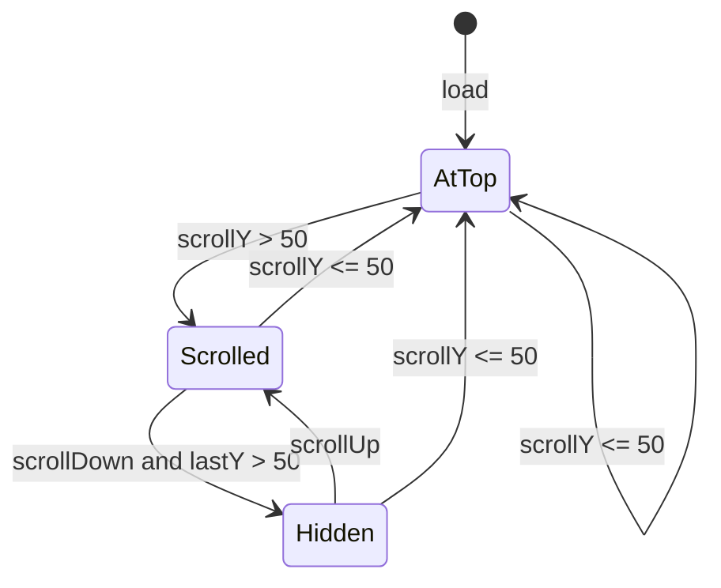

# Header Scroll Visual States — Design Spec

**Date:** 2026-06-14  
**Status:** Approved pending implementation  
**Scope:** Full `<header>` row in [`Header.astro`](../../../src/components/header/Header.astro) (Logo + MainNav + ThemeToggle + sliding pill)

## Goal

Five scroll-driven visual states for the sticky site header on desktop and mobile, without breaking the existing sliding pill indicator.

## State Machine

| State | Trigger | Background / blur | Transform |
|-------|---------|-------------------|-----------|
| **1 — At top** | `scrollY ≤ 50px` | Transparent, no `backdrop-filter` | `translateY(0)` |
| **2 — Scrolled** | First crossing of 50px threshold (still visible) | `oklch(from var(--color-bgAlt) l c h / 0.8)` + `blur(10px)` | `translateY(0)` |
| **3 — Hidden** | Continue scrolling **down** while already above threshold | Same as State 2 (applied when re-shown) | `translateY(-100%)` |
| **4 — Reveal** | Scroll **up** at any position | State 2 styling if `scrollY > 50px` | `translateY(0)` |
| **5 — Return to top** | `scrollY ≤ 50px` again | Transparent, no blur | `translateY(0)` |

### Threshold logic (critical detail)

State 3 must **not** fire on the same gesture that crosses the 50px threshold. Hide only when:

- `scrollY > THRESHOLD` **and**
- `scrollY > lastScrollY` (scrolling down) **and**
- `lastScrollY > THRESHOLD` (was already scrolled before this frame)

This yields State 2 on the first pass past 50px, State 3 on subsequent downward scroll.

## Approach Comparison

| Approach | Verdict |
|----------|---------|
| **B — Vanilla JS in Header.astro** | **Recommended.** Discrete class toggles, direction-aware hide, no new dependency, co-located with pill script, works in Firefox |
| A — `astro-scroll-observer` | Rejected for v1. Adds dependency; project has no `MainLayout.astro`; `data-is-scrolling-up` on `<html>` is viable but overlaps with pill script location |
| CSS scroll-driven animations | Rejected. Poor Firefox support; guide recommends JS fallback anyway; hide-on-scroll-up needs direction state |

## Architecture

**Owner:** [`Header.astro`](../../../src/components/header/Header.astro) — not [`MainNavDesktop.astro`](../../../src/components/nav/MainNavDesktop.astro). MainNavDesktop markup/CSS unchanged except optional shared class hooks if needed.

**Classes on `<header>`:**

- `site-header` — base + transitions
- `is-at-top` — State 1 / 5
- `is-scrolled` — State 2 / 4 (when not at top)
- `is-header-hidden` — State 3 (avoid Uno `hidden` conflict)

**Styles:**

- Default `.header-pill-host`: transparent background, no blur (remove current always-on blur)
- `.site-header.is-scrolled .header-pill-host`: bg + blur (component CSS or Uno utilities)
- `.site-header.is-header-hidden`: `-translate-y-full` with `transition-transform duration-300 ease-out`
- `@media (prefers-reduced-motion: reduce)`: instant transform, keep state logic

## Pill Indicator Compatibility

- Pill host stays inside `.header-pill-host`; header translate moves pill with targets
- Existing `ResizeObserver` on `.header-pill-host` remains valid
- No changes to pill target selectors or directional entry logic

## Out of Scope

- `astro-scroll-observer` integration
- Scroll states isolated to `.nav-desktop` only
- `position: fixed` header (keep `sticky` unless layout issues arise)
- Auto-commit of this spec

## Verification

1. Load page at top → transparent bar, pill works on hover
2. Scroll down past 50px → blur/bg appears, bar still visible
3. Keep scrolling down → bar slides up and hides
4. Scroll up mid-page → bar reappears with blur
5. Scroll to top → transparent again
6. `prefers-reduced-motion: reduce` → states still toggle, no animated slide
7. `pnpm run check` and `pnpm run build` pass
