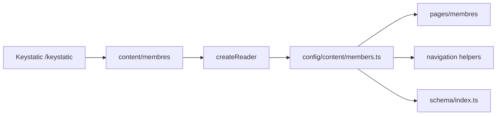

# Membres Keystatic — Design Spec

**Date :** 2026-06-17  
**Statut :** approuvé pour implémentation (révisé — garde-fous runtime)  
**Périmètre phase 1 :** collection Keystatic `membres`, loader build-time mémoïsé, page membre unique, composants MDX bio, admin local

## Objectif

Remplacer le tableau statique `config/content/members.ts` par du contenu versionné dans `content/membres/`, éditable via Keystatic. Chaque membre expose des coordonnées structurées et une bio MDX riche (vidéo, audio, carrousel, mini galerie).

## Checklist go/no-go (avant la première ligne de code)

L’agent d’implémentation **doit** valider chaque point No-Go avant Task 1 du plan. Les points Go sous condition sont documentés dans le plan ; les dettes acceptées sont tracées explicitement.

### No-Go — validation impérative

| Vérification | Action exigée | Critère de passage |
|--------------|---------------|-------------------|
| **POC bi-fichier** | Créer une collection test avec `fields.document` (coordonnees) et `fields.mdx` (bio) sur le même `path`, deux entrées de test | `pnpm build` passe ; le reader retourne un objet avec coordonnees (frontmatter) et bio (MDX) |
| **Stratégie d’assets** | Décider et configurer le chemin des images uploadées | `public/images/membres/` + `directory` / `publicPath` dans le schéma Keystatic ; une image uploadée depuis l’admin s’affiche en dev et en build |
| **Audit consommateurs sync** | Lister exhaustivement les imports de l’ancien `members.ts` | `rg "from.*members" src config` — chaque fichier migré vers `await getMembers()` ; `pnpm check` et `pnpm build` sans erreur sur l’export synchrone |
| **Cache build-time** | Mémoïsation module-level dans `config/content/members.ts` | Un `console.log` côté loader ne s’affiche qu’**une fois** par build, même si `getMembers()` est appelé depuis Layout, MemberShell, schema, `[slug].astro` |
| **Contrat de normalisation** | Centraliser dans `src/utils/media/normalizeEmbed.ts` | Fonctions testées (manuellement) : `normalizeTel`, `youtubeId`, `vimeoId`, `dailymotionId`, `extractAudioEmbedUrl` — retournent `{ valid: false, reason }` ou la valeur normalisée |

**Consommateurs sync connus (audit initial) :**

| Fichier | Migration |
|---------|-----------|
| `config/content/navigation.ts` | `buildMemberNav(await getMemberProfiles())` |
| `src/components/nav/MemberNav.astro` | prop `items` obligatoire |
| `src/utils/schema/index.ts` | param `members` sur helpers SEO |
| `src/pages/membres/index.astro` | `await getMembers()` |
| `src/pages/membres/[slug].astro` | `getStaticPaths` strict + `Astro.props.member` |

Pas de `sitemap.xml.ts` / `rss.xml.ts` dans le repo à ce jour — ré-auditer avant merge si ajoutés.

### Go sous condition — décisions verrouillées

| Sujet | Décision | Pourquoi |
|-------|----------|----------|
| **404 membre invalide** | `getStaticPaths` strict uniquement (pas de `Astro.redirect('/404')`) | En SSG standard le redirect est du code mort ; évite divergence dev/prod |
| **Mapping props ↔ component blocks** | Tableau explicite dans `src/components/mdx/README.md` | Zone à plus haut risque de désynchronisation Keystatic ↔ Astro |
| **Contraintes MDX éditeurs** | Documenter : pas d’imports internes ni HTML brut dans `bio.mdx` | Keystatic l’interdit ; évite des erreurs de build silencieuses |
| **Accessibilité interactifs** | Carrousel : `aria-live="polite"` + annonce slide X/Y ; lightbox : `<dialog>`, focus restauré, Échap ; iframes : `title` obligatoire | Le « JS vanilla minimal » ne garantit pas le comportement sans spec écrite |

### Dettes acceptées — phase 1

| Dette | Mitigation immédiate |
|-------|---------------------|
| Double déclaration composants MDX | Schémas dans `keystatic.config.ts` (phase 1) ; commentaire `// SYNC WITH src/components/mdx/xxx.astro` sur chaque composant Astro |
| Types manuels `member.d.ts` | Commentaire `// WARNING: sync with keystatic.config.ts` en tête du fichier ; tâche backlog « resync à chaque changement de champ » |
| Pas de statut brouillon/publié | Note admin : « Toute sauvegarde est publiée au build suivant » |
| Assets binaires sans Git LFS | `// TODO: activer Git LFS sur public/videos/ et public/audio/` avant bascule GitHub |
| Bascule GitHub non spécifiée | `storage: { kind: 'github' }` nécessite une GitHub App, un repo et une branche — pas seulement des variables d’environnement |

## Décisions validées

| Sujet | Choix |
|-------|-------|
| Métadonnées (`slug`, `name`, `role`, `title`, `description`, `titleNav`) | Champs Keystatic, frontmatter de `coordonnees.md` |
| Coordonnées | Champs structurés : email, téléphone, adresse, `socialLinks[]`, `websites[]` |
| Consommation Astro | Keystatic Reader API uniquement (pas de `content/config.ts` en phase 1) |
| Stockage | `local` maintenant ; bascule `github` documentée pour plus tard |
| Pages | Une page `/membres/{slug}/` ; composants séparés pour sous-pages futures |
| `members.ts` | `getMembers()` / `getMemberBySlug()` async, dérivés du reader |

## Architecture

### Arborescence

```
keystatic.config.ts
content/
└── membres/
    ├── alice/
    │   ├── coordonnees.md
    │   └── bio.mdx
    └── brice/
        ├── coordonnees.md
        └── bio.mdx

public/images/membres/          ← assets bio (carrousel, galerie)

src/
├── keystatic/
│   └── reader.ts
├── utils/
│   └── media/
│       └── normalizeEmbed.ts   ← tel, YouTube/Vimeo/Dailymotion, audio embeds
└── components/
    ├── layout/
    │   └── MemberShell.astro
    ├── members/
    │   └── MemberCoordonnees.astro
    └── mdx/
        ├── README.md               ← mapping Keystatic ↔ Astro
        ├── VideoEmbed.astro      ← YouTube, Vimeo, Dailymotion, MP4 hébergé
        ├── AudioPlayer.astro     ← embeds plateforme + MP3 hébergé
        ├── Carousel.astro
        └── MiniGallery.astro

config/
├── content/
│   └── members.ts                ← loader async
└── types/content/
    └── member.d.ts               ← types étendus
```

Le header site reste `src/components/header/Header.astro` (inchangé). `MemberShell` est le layout **interne** à la page membre (titre, nav membres, sections).

### Schéma Keystatic — collection `membres`

```ts
format: { path: 'content/membres/*/' }
// Pas de contentField — frontmatter dans coordonnees.md, index.yaml vide (audit Task 2)
```

| Champ | Type Keystatic | Fichier |
|-------|----------------|---------|
| `coordonnees` | `fields.document` (schéma structuré, corps markdown vide) | `coordonnees.md` |
| `bio` | `fields.mdx` + component blocks | `bio.mdx` |

> **API Keystatic :** `fields.document` n’a **pas** d’option `formatting: { data: "yaml" }`. Le paramètre `formatting` contrôle l’UI éditeur, pas la sérialisation. Keystatic écrit automatiquement le frontmatter YAML pour les champs structurés ; le corps reste vide si aucun contenu libre n’est saisi.

> **Contraintes `bio.mdx` :** pas d’imports internes, pas de balises HTML brutes (limitation Keystatic). Documenter dans un commentaire en tête de `keystatic.config.ts` et dans `src/components/mdx/README.md`.

**Frontmatter `coordonnees.md` :** `slug`, `name`, `role`, `title`, `description`, `titleNav`, `email`, `phone`, `address` (street, postalCode, city), `socialLinks[]` (label, url), `websites[]` (label, url).

### Flux de données



### Stockage

- **Phase 1 :** `storage: { kind: 'local' }`
- **Assets images :** `public/images/membres/` via `fields.image` (`directory` + `publicPath` dans le schéma). Accepte la perte du pipeline `astro:assets` en phase 1.
- **Objectif GitHub :** `storage: { kind: 'github', repo: '…', branch: 'main' }` via GitHub App (pas seulement des variables d’environnement) ; activer Git LFS sur `public/videos/` et `public/audio/` avant bascule

---

## Section 2 — Composants et rendu

### `MemberShell.astro`

Layout fixe de chaque page membre, à l’intérieur de `Layout` site :

```astro
<Prose>
  <h1>{member.name}</h1>
  <MemberNav items={memberNavItems} currentPath={...} />
  <slot name="coordonnees" />
  <slot name="bio" />
</Prose>
```

Props : `member` (métadonnées), `memberNavItems`, `currentPath`. Les slots permettent de découper en sous-pages plus tard sans changer le shell.

### `MemberCoordonnees.astro`

Rendu sémantique des champs structurés :

- Email → `mailto:`
- Téléphone → `tel:` via `normalizeTel()` (`src/utils/media/normalizeEmbed.ts`)
- Adresse → bloc `<address>`
- `socialLinks` → liste de liens externes (`rel="noopener noreferrer"`)
- `websites` → liste de sites web (`rel="noopener noreferrer"`)

Pas de markdown libre dans ce module.

### Composants MDX (`src/components/mdx/`)

Enregistrés dans `@astrojs/mdx` **et** comme Keystatic component blocks pour l’édition visuelle dans l’admin. Les composants Astro **n’importent que** `src/utils/media/normalizeEmbed.ts` pour le parsing d’URL — pas de regex dispersées.

#### Mapping Keystatic ↔ Astro (`src/components/mdx/README.md`)

| Keystatic block | Composant Astro | Props |
|----------------|-----------------|-------|
| `VideoEmbed` | `VideoEmbed.astro` | `platform`, `url`, `src`, `title` |
| `AudioPlayer` | `AudioPlayer.astro` | `platform`, `embedUrl`, `src`, `title` |
| `Carousel` | `Carousel.astro` | `images[]`, `id?` |
| `MiniGallery` | `MiniGallery.astro` | `images[]`, `columns?` |

#### `VideoEmbed.astro`

| Mode | Prop `platform` | Rendu |
|------|-----------------|-------|
| Embed | `youtube` \| `vimeo` \| `dailymotion` | `<iframe>` responsive 16:9 (`aspect-ratio` + `width/height` attrs) |
| Hébergé | `hosted` | `<video controls preload="metadata">` pointant vers `src` dans `public/` |

Props : `platform`, `url` (embed ou page plateforme — normalisation via `normalizeEmbed`), `src` (chemin public pour MP4), `title` (accessibilité iframe, **obligatoire**).

Recommandation contenu : MP4 courts (&lt; 30 s, 720p, ~5–15 Mo) dans `public/videos/membres/` ; vidéos longues → embed plateforme.

#### `AudioPlayer.astro`

| Mode | `platform` | Rendu |
|------|------------|-------|
| Embed | `spotify` \| `deezer` \| `soundcloud` \| `radio-france` \| `arte` | `<iframe>` avec `src` d’embed extrait de l’URL « intégrer » |
| Hébergé | `hosted` | `<audio controls preload="metadata">` + UI minimale custom (play/pause, barre de progression native) |

Props : `platform`, `embedUrl` ou `src`, `title` (**obligatoire** pour iframes). URLs embed normalisées via `extractAudioEmbedUrl()`.

#### `Carousel.astro`

- Props : `images: { src, alt, caption? }[]`, `id` (unique pour `aria-controls`)
- Navigation précédent / suivant (boutons + clavier ← →)
- **`aria-live="polite"`** sur le conteneur de slides ; annonce visuelle du numéro de slide (ex. `<span class="sr-only">Slide 1 sur 3</span>`)
- Légende optionnelle sous l’image active
- Images via chemins `public/images/membres/…`
- JS vanilla minimal dans le composant (pas de lib lourde)

#### `MiniGallery.astro`

- Props : `images: { src, alt, caption? }[]`, `columns` (défaut 3)
- Grille responsive ; clic ouvre une lightbox (`<dialog>` natif)
- Fermeture : Échap, clic backdrop, bouton fermer
- **Restauration du focus** sur le bouton déclencheur après fermeture (`data-trigger-index` + `focus()`)
- Différent du carrousel : vue d’ensemble vs séquence

### Rendu page `src/pages/membres/[slug].astro`

```astro
---
export async function getStaticPaths() {
  const members = await getMembers(); // cache module-level — une seule lecture FS
  return members.map((member) => ({ params: { slug: member.slug }, props: { member } }));
}
const { member } = Astro.props; // pas de second getMembers() pour le profil
const members = await getMembers(); // retourne le cache pour la nav
const entry = await reader.collections.membres.read(member.slug);
const bioDoc = await entry?.bio();
const BioContent = bioDoc?.content;
---

<Layout title={member.title} description={member.description}>
  <MemberShell member={member} memberNavItems={buildMemberNav(members)} currentPath={...}>
    <MemberCoordonnees slot="coordonnees" coordonnees={member.coordonnees} />
    <section slot="bio" class="stack-md">
      {BioContent && <BioContent components={mdxComponents} />}
    </section>
  </MemberShell>
</Layout>
```

`mdxComponents` mappe les noms vers les fichiers `.astro` dans `src/components/mdx/`.

### Admin Keystatic

- Intégration `@keystatic/astro` → route `/keystatic` (dev)
- Création membre : slug + remplissage coordonnées + bio
- Component blocks dans le champ `bio` : Vidéo, Audio, Carrousel, Mini galerie
- Images uploadées vers `public/images/membres/` via config `fields.image`
- **Publication :** toute sauvegarde est publiée au build suivant (pas de brouillon en phase 1)

### Migration `alice` / `brice` — checklist

| Critère | Exigence |
|---------|----------|
| Parité slugs | `alice` et `brice` identiques à l’ancien `members.ts` |
| Parité SEO | `title`, `description`, `titleNav` recopiés à l’identique |
| Coordonnées | email `@dekamus.fr` ; adresse remplie (même fictive) ; `socialLinks: []` et `websites: []` explicites |
| `bio.mdx` | Au moins un paragraphe **et** un component block de test (même factice) pour valider la chaîne de rendu |
| Legacy | Supprimer ou renommer `members.ts` → `members.ts.legacy` pour forcer la résolution des imports restants |

---

## Section 3 — Types, erreurs, tests

### Types (`config/types/content/member.d.ts`)

> `// WARNING: sync with keystatic.config.ts` — resynchroniser à chaque changement de champ Keystatic.

```ts
export interface MemberAddress {
  street: string;
  postalCode: string;
  city: string;
}

export interface MemberSocialLink {
  label: string;
  url: string;
}

export interface MemberWebsite {
  label: string;
  url: string;
}

export interface MemberCoordonnees {
  email: string;
  phone: string;
  address: MemberAddress;
  socialLinks: MemberSocialLink[];
  websites: MemberWebsite[];
}

export interface MemberProfile {
  slug: string;
  name: string;
  role: string;
  title: string;
  description: string;
  titleNav?: string;
}

export interface Member extends MemberProfile {
  coordonnees: MemberCoordonnees;
}
```

### Refactor consommateurs synchrones

| Fichier | Changement |
|---------|------------|
| `config/content/navigation.ts` | `buildMemberNav(members: MemberProfile[])` à la place de `export const memberNav` |
| `src/components/nav/MemberNav.astro` | Prop `items: NavItem[]` obligatoire |
| `src/utils/schema/index.ts` | `allSchemaPages(members)` et `breadcrumbItems(..., members)` |
| `src/pages/membres/*.astro` | `await getMembers()` en frontmatter |

### Loader (`config/content/members.ts`)

- `getMembers()` / `getMemberBySlug()` / `getMemberProfiles()` async via Reader API
- **Cache module-level** : `let membersCache: Member[] | null = null` — une seule lecture filesystem par build Astro

### Gestion d’erreurs

- **Pages membre :** `getStaticPaths` strict — seuls les slugs connus sont générés (pas de `Astro.redirect('/404')` en SSG)
- `getMemberBySlug` : retourne `undefined` si slug absent (usage programmatique uniquement)
- Champs coordonnées optionnels vides : ne pas rendre la ligne (pas de `mailto:` vide)
- `bio` absente : section bio omise (pas d’erreur build)
- URL embed invalide : composant MDX affiche un message d’erreur visible en dev, rien en prod (ou fallback discret) — via `{ valid: false, reason }` de `normalizeEmbed`

### Tests / vérification

| Vérification | Commande / action |
|--------------|---------------------|
| **Go/no-go** | Checklist en tête de spec + Task 0 du plan |
| Lint + types | `pnpm check` |
| Build statique | `pnpm build` |
| Cache loader | `console.log` dans `getMembers` — une seule trace par build |
| Audit imports | `rg "from.*members" src config` — zéro import synchrone restant |
| Admin Keystatic | `pnpm dev` → `/keystatic` → créer `newmember`, vérifier fichiers + liste membres |
| Rendu MDX | Page membre avec chaque component block |
| Accessibilité | Carrousel (focus, aria-live), lightbox (`dialog`, focus trap), iframes (`title`) |

### Hors périmètre phase 1

- `content/config.ts` (Zod Astro collections)
- Stockage GitHub Keystatic (config préparée, non activée)
- Sous-pages `/membres/{slug}/coordonnees/`
- Vidéos longues hébergées dans `public/`
